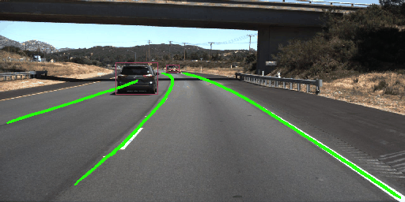
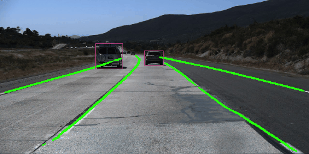

# Lane-Car-detection

Real time highway lane and car detection by Anshul Devnani, and Dae Cheol Kwon

Results

FYI: All paths in files mentioned will not work on your computer, all these paths must be adpated to your env.

Guide for downloading dataset:
1. For Lane Detection download the dataset from https://github.com/TuSimple/tusimple-benchmark/issues/3
Download the trainset and test set
the directory structure should look like:
- data/
    -test_set/
    -train_set/

2. For deep drive dataset download from https://bdd-data.berkeley.edu/
Download the 100k version
The directory structure should look like:
- data/
    - test/
    - train/
    - val/
    - bdd100k_labels_images_train.json
    - bdd100k_labels_images_val.json

Guide for training:
- Lane Detection
    1. You must first run /lane_detection/utils/dataset_prepare.py this will parse the dataset, generate gt masks and put them in folders, text files that the dataloader will read. YOU MUST FIX THE PATHS IN THIS FILE TO SUIT YOUR ENV. If this runs correctly you will have the follwing directory structure in the dataset directory:
    - dataset / 
        - ground_truth_binary_seg/
        - ground_truth_image/
        - ground_truth_instance_seg/
        - dataset_image_paths.txt
        - train_split.txt
        - valid_split.txt

    NOTE: in order to produce a test dataset txt file, youll have to adapt the dataset_prepare.py accordingly

    2. Now you are ready to train. Simply run python train.py
    NOTE: adapt all paths in this python file accordingly, hyperparamters are defined in this file as well. model/model.py defines the each model. As you train the best model will be saved

    3. Once your done training you can either run lane_detection/lane.py to get f1 scores and accuracy. You must modfiy this file to account for model you want to evaluate. 

- Car Detection
    1. To train simply run train.py. Adapt all paths as necessary
    2. A model will be saved after each epoch

Once you have lane and car detection models you can run lane_detection/gif.py that will produce a gif that shows both car, lane, and driver alert inference as well as give you model FPS data. Couple things will need to be done to get his running

    1. modify the paths to each trained model weights, see lines 119 to 125
    2. the top_level_folder_paths list will need to be modified. Since we use the TUsimple test dataset to test our models the paths to each top level folder will need to be specifed. See line 128 for an example of how to specify the paths. Each top level folder has 20 frames in them. This is a list so you can specify as many top level folder paths as youd like. If you specifiy 2 top level folder paths a gif of 40 frames will be prodcued. The gifs in the result section of this readme are produced by running gif.py

Unfortunatly we cant upload model weights (expect for the car detection using the mobilenet backbone) because the sizes are too big

